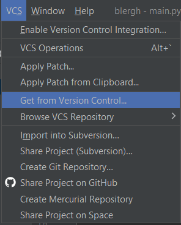
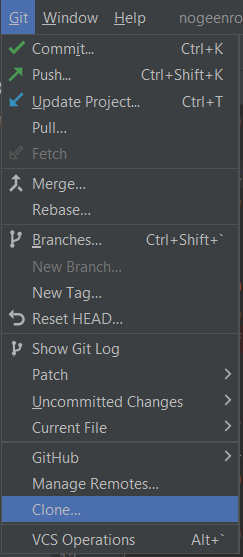
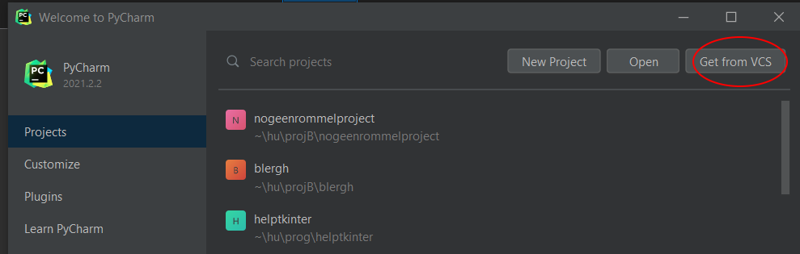

# Project Team Workshop Git II

Welkom! In deze les gaan we oefenen met de Git functionaliteiten die jullie nodig hebben om succesvol samen te werken in jullie project.

De eerste stap is het forken van deze repository. Dit kan helaas niet via GitHub Classroom, omdat die git historie voor jullie verbergt. Door te forken maak je een persoonlijke kopie van dit repository op GitHub, waar je zelf naar kan pushen. Klik hiervoor op de Fork-knop rechtsboven en volg de instructies. **Kies ervoor niet alleen de main branch over te nemen!**

Nadat je deze repository geforkt hebt moet je deze lokaal clonen. Je hebt hiervoor de URL nodig van de repo, die je mee kan geven met het `git clone` commando, of binnen PyCharm via een van de onderstaande opties.

Nadat je een lokale kopie hebt gemaakt, kun je het project in Python openen. Je gaat nu steeds het bestand `tutorial.py` uitvoeren. Het bestand `project.py` bevat code die je in de oefneningen zelf gaat aanpassen.

